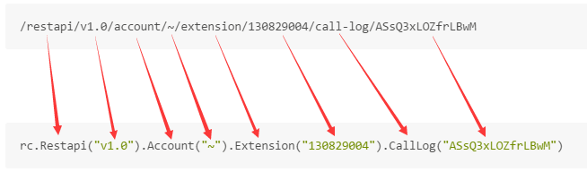

# ringcentral-csharp-client

[](https://ci.appveyor.com/project/tylerlong/ringcentral-csharp-client)
[](https://coveralls.io/github/ringcentral/ringcentral-csharp-client?branch=master)
[](https://glipped.herokuapp.com/)

RingCentral C# client.

**Notice:** any issues or questions, please do let me know by [creating an issue](https://github.com/ringcentral/ringcentral-csharp-client/issues/new).

Feel free to :star: and :fork_and_knife: this repository.


## Installation

```powershell
Install-Package RingCentral.Client
```


## API Reference

[RingCentral API Reference](https://developer.ringcentral.com/api-docs/latest/index.html#!#APIReference.html) is where you can find all the endpoints, requests, parameters and all kinds of necessary details.

Please note: as a guest reader, you can only read the basic version of API Reference. Please do login if you want to get information about Advanced API endpoints.


## Initialization

```cs
using RingCentral;

rc = new RestClient("appKey", "appSecret");
```

By default the clients talk to sandbox server. If you want production server:

```cs
rc = new RestClient("appKey", "appSecret", true);
```

Or you can specify the server url explicitly:

```cs
rc = new RestClient("appKey", "appSecret", "https://platform.devtest.ringcentral.com");
```


## Authorization

```cs
await rc.Authorize("username", "extension", "password");
```

If you use direct number as username, leave extension empty.


### Auto refresh

By default, there is a background timer calling `rc.Refresh()` periodically, so the authorization never expires.

But if you would like to call `Refresh` manually:

```cs
rc.AutoRefreshToken = false;
```


### Token Revoke

When you no longer need a token, don't forget to revoke it: `rc.Revoke()`.


## Map URI to code

This client library is built around URIs.
Please read this part carefully and make sure you get it before continuing.

Let's go to the [RingCentral API Reference](https://developer.ringcentral.com/api-docs/latest/index.html#!#APIReference.html) to find
[an example](https://developer.ringcentral.com/api-docs/latest/index.html#!#RefExtensionCallLogRecord.html).

We can see that the URI pattern is:

```
/restapi/v1.0/account/{accountId}/extension/{extensionId}/call-log/{callRecordId}
```

An real example of the URI could be:

```none
/restapi/v1.0/account/~/extension/130829004/call-log/ASsQ3xLOZfrLBwM
```

Let's map the URI above to code:

```cs
rc.Restapi("v1.0").Account("~").Extension("130829004").CallLog("ASsQ3xLOZfrLBwM");
```

It's just a one-to-one mapping:




##### Default ID

The default ID for `Restapi` is `v1.0`, the default ID for `Account` and `Extension` is `~`.

We can omit arguments to use default value:

```cs
rc.Restapi().Account().Extension("130829004").CallLog("ASsQ3xLOZfrLBwM");
```

You can also break it into multiple lines if you don't like long-chained method calls:

```cs
var account = rc.Restapi().Account();
var extension = account.Extension("130829004");
var callLog = extension.CallLog("ASsQ3xLOZfrLBwM");
```


## Anonymous types vs Pre-defined types

For example, the following line is for sending fax:

```cs
var response = await extension.Fax().Post(requestBody, attachments);
```

To create the `requestBody` object, you can define it as following:

```cs
var requestBody = new FaxPath.PostParameters
{
    to = new CallerInfo[] { new CallerInfo { phoneNumber = "123456789" } }
}
```

Or, you can define it using anonymous types:

```cs
var requestBody = new
{
    to = new object[] { new { phoneNumber = "123456789" } }
}
```

Both are OK. The anonymous types approach is shorter while you can take advantages of IDE intellisense with pre-defined types approach.
You can choose based on your preferences.


## Talk to API Server

```cs
var extension = rc.Restapi().Account().Extension();
```


### GET

##### List all of the inbound call Logs

```cs
var callLogs = await extension.CallLog().List(new { direction = "Inbound" });
```

Or if you prefer the query parameters as a typed model:

```cs
var callLogs = await extension.CallLog().List(new CallLog.ListParameters { direction = "Inbound" });
```

All the HTTP calls are by default async, so you should use the `await` keyword of C#.


##### Get a call log by ID

```cs
var callLog = await extension.CallLog("ASsQ3xLOZfrLBwM").Get();
```

You can inspect the attributes of the returned `callLog` object because it is a model instead of a string:

```cs
Console.WriteLine(callLog.id);
Console.WriteLine(callLog.direction);
Console.WriteLine(callLog.startTime);
```


### POST

##### Send an SMS

```cs
var requestBody = new {
    text = "hello world",
    from = new { phoneNumber = phoneNumber },
    to = new object[] { new { phoneNumber = phoneNumber } }
};
var response = await extension.Sms().Post(requestBody);
```


### PUT

##### Update message status

```cs
var requestBody = new { readStatus = "Read" };
var response = await extension.MessageStore(messageId).Put(requestBody);
```


### DELETE

##### Delete message by ID

```cs
var response = await extension.MessageStore(messageId).Delete();
```


## What if I want plain HTTP without those fancy models?

```cs
var endpoint = rc.Restapi().Dictionary().Timezone("6").Endpoint(); // "/restapi/v1.0/dictionary/timezone/6"
var response = await rc.Get(endpoint); // make http request
var statusCode = response.StatusCode; // check status code
var str = await response.Content.ReadAsStringAsync(); // get response string
```


## Subscription

```cs
var subscription = rc.Restapi().Subscription().New();
subscription.EventFilters.Add("/restapi/v1.0/account/~/extension/~/message-store");
subscription.EventFilters.Add("/restapi/v1.0/account/~/extension/~/presence?detailedTelephonyState=true");
subscription.NotificationEvent += (sender, args) => {
    var notification = args.notification;
    Console.WriteLine(notification.json);
    // If you want to play with plain JSON instead
    // You can ignore the switch statement below.
    switch (notification.type)
    {
        case NotificationType.Message:
            var messageNotification = notification.Downcast<MessageNotification>();
            // do something with messageNotification
            break;
        case NotificationType.DetailedPresence:
            var detailedPresenceNotification = notification.Downcast<DetailedPresenceNotification>();
            // do something with detailedPresenceNotification
            break;
        default:
            break;
    }
};
await subscription.Register();
```

The subscription will renew itself automatically before it expires. In rare cases you might need to renew it manually:

```cs
await subscription.Renew();
```


## Send Fax

```cs
var attachment1 = new Attachment { fileName = "test.txt", contentType = "text/plain", bytes = Encoding.UTF8.GetBytes("hello world") };
var attachment2 = new Attachment { fileName = "test.pdf", contentType = "application/pdf", bytes = File.ReadAllBytes("test.pdf") };
var attachments = new Attachment[] { attachment1, attachment2 };
var response = await extension.Fax().Post(new FaxPath.PostParameters
{
    to = new CallerInfo[] { new CallerInfo { phoneNumber = Config.Instance.receiver } }
}, attachments);
```


## Binary data

#### Create/Update profile image

```cs
// create
var bytes = File.ReadAllBytes("test.png");
var response = await extension.ProfileImage().Post(bytes, "test.png");

// update
var bytes = File.ReadAllBytes("test.png");
var response = await extension.ProfileImage().Put(bytes, "test.png");
```

#### Get message content

```cs
var response = await extension.MessageStore().List()
var messages = response.records;

// sms
var message = messages.Where(m => m.type == "SMS" && m.attachments != null && m.attachments.Length > 0).First();
var content = await extension.MessageStore(message.id).Content(message.attachments[0].id).Get();
var str = System.Text.Encoding.UTF8.GetString(content.data);

// fax
message = messages.Where(m => m.type == "Fax" && m.attachments != null && m.attachments.Length > 0).First();
content = await extension.MessageStore(message.id).Content(message.attachments[0].id).Get();
File.WriteAllBytes("test.pdf", content.data);
```


#### Download call recording

```cs
var account = rc.Restapi().Account();

// List call Logs
var queryParams = new CallLogPath.ListParameters
{
    type = "Voice",
    view = "Detailed",
    dateFrom = DateTime.UtcNow.AddDays(-100).ToString("o"),
    withRecording = true,
    perPage = 10,
};
var callLogs = await account.CallLog().List(queryParams);

// download a call recording
var callLog = callLogs.records[0];
var content = await account.Recording(callLog.recording.id).Content().Get();
File.WriteAllBytes("test.wav", content.data);
```


## Exception handling

```cs
try
{
    await ...
}
catch (FlurlHttpException fhe)
{
    if (fhe.Call.Response.StatusCode == System.Net.HttpStatusCode.NotFound)
	{
		Console.WriteLine("The resource doesn't exist");
	}
}
```


## Sample code

The [unit test project](https://github.com/ringcentral/ringcentral-csharp-client/tree/master/RingCentral.Test) contains lots of useful code snippets.
Such as this [test class](https://github.com/ringcentral/ringcentral-csharp-client/blob/master/RingCentral.Test/ContactTest.cs).


## Lisence

MIT
